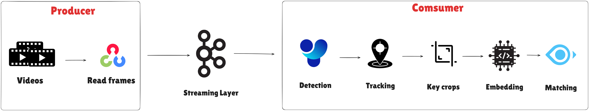
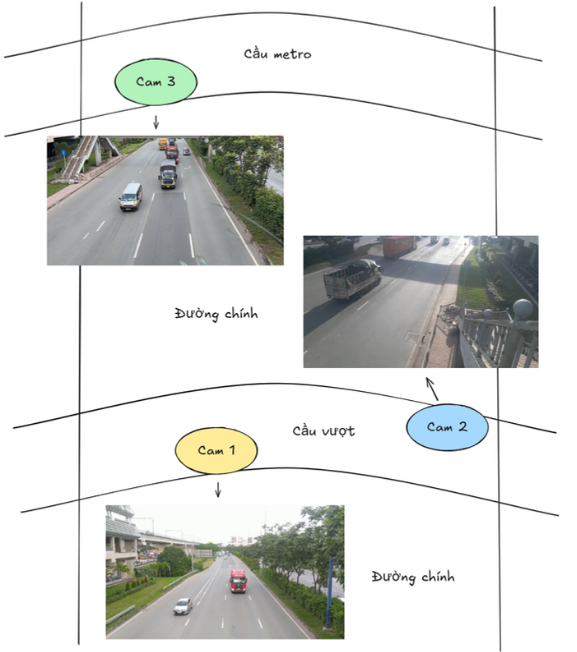

<h1 align="center"><u><b>Vehicle ReID and MultiCamera Tracking Online</b></u></h1>

<p align="center">
  Hệ thống tái định danh (ReID) và theo dõi phương tiện đa camera theo thời gian thực mô phỏng (online).
</p>

---

### 1) Pipeline

This project performs **vehicle re-identification (ReID)** and **online multi-camera vehicle tracking**. The processing flow is: read frames from multiple camera videos → stream frames via Kafka → detect vehicles → track per-camera trajectories → extract a single ReID embedding per track → match the same vehicle across cameras and store/search embeddings efficiently using Milvus.

<p align="center">
  
</p>

#### System modules summary

- **Producer**
  - **Video input**: Videos from multiple cameras recorded at the same time, with shared objects across views.
  - **Read frames**: Read frames from video and publish them to Kafka.

- **Streaming layer**
  - A middle layer that receives and forwards frames to consumers (each camera stream is processed in **parallel**, simulating a multi-camera setup).

- **Consumer**
  - **Detection**: Detect vehicles and filter target classes (**car, bus, train, truck**).
  - **Tracking**: Track each vehicle within each camera stream.
  - **Key crops**: Select **k** best crop frames per track.
  - **Embedding**: Convert the selected crops into **one embedding vector**.
  - **Matching**: Associate tracks of the same vehicle across different cameras (using **camera layout**, **travel time**, and **embedding similarity**; the matching logic can be tuned to the dataset). A **vector database** is used for fast storage and similarity search.

### 2) Tech stack

- Frame reading: **OpenCV**
- Streaming layer: **Apache Kafka**
- Detection: **YOLOv8x**
- Tracking: **ByteTrack**
- Embedding: **FastReID (VeRi)**
- Matching: Heuristics based on camera position, travel time, and embedding similarity, ...
- Database: **Milvus**

### 3) Dataset

- A Vietnam traffic dataset collected at the **metro overpass near the university village area**, recorded by **three smartphones** following the placement below. Special thanks to **Ngọc Anh** and **Thiên Bảo** for supporting data collection and preprocessing.

<p align="center">
  
</p>

- The dataset is used to **train** the ReID model, **evaluate** performance, and **test** the online system.
- Dataset: [Google Drive](https://drive.google.com/drive/folders/1dZf6Hjcx2r03T-2O1fKinT8j0PBeEYyM?usp=drive_link)

### 4) Repository structure

> Note: the repo includes large data/log folders; the tree below is a simplified view.

```text
Vehicle/
├── assets/
├── config/
│   └── config.yaml
├── consumer/
│   ├── main.py
│   ├── bytetrack/
│   ├── detection/
│   ├── log_utils/
│   ├── matching/
│   └── reid/
├── producer/
│   ├── create_topic.py
│   └── streaming_video.py
├── tools/
├── models/
├── data/
│   ├── videos/
│   ├── zones/
│   ├── gt/
├── docker-compose.yml
├── requirements.txt
```

### 5) Installation & usage

#### Installation

1. Clone the repository:

```bash
git clone https://github.com/KL0224/Vehicle_ReID_MTMC.git
```

2. Install Apache Kafka locally: https://kafka.apache.org/community/downloads/

3. Start Milvus using Docker Compose:

```bash
docker compose up -d
```

4. Create a virtual environment and install dependencies:

```bash
pip install -r requirements.txt
```

- Note: Install **CUDA-enabled PyTorch** to leverage GPU acceleration.

5. Download model weights and put them under `models/`.

6. Put multi-camera videos under `data/videos/`.

#### Run

Open **two terminals**: producer and consumer.

**Terminal 1 — Producer** (Kafka server must be running):

```bash
python producer/create_topic.py
python producer/streaming_video.py
```

**Terminal 2 — Consumer**

```bash
python consumer/main.py
```


#### Outputs

During runtime, the system generates:

- Logs under `log/` (or `logs/`, depending on configuration).
- Per-camera result folders under `tracking_results/` (each camera folder contains cropped images per vehicle and a `camera*.txt` file in MOT format).

### 6) Contributing

Contact: **phamanhkiet97123@gmail.com**

### 7) License

MIT

